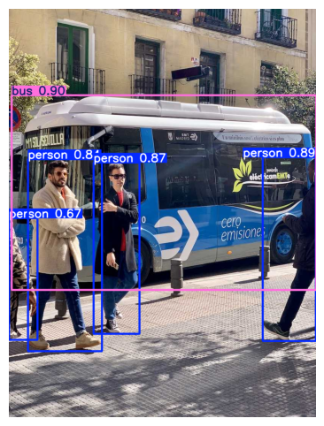
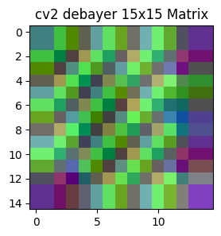
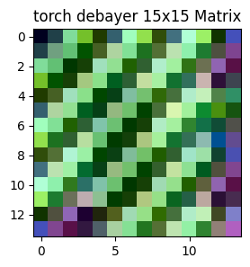

# The YOLOv5 Playbook
## A Deep Dive into Object Detection

#### Authors : Huangyi Qin, ChatGPction


---
## Introduction

### What is YOLOv5?  

YOLOv5 (You Only Look Once v5) is a state-of-the-art real-time object detection model developed by Ultralytics. It is based on a single-stage convolutional neural network (CNN) and is designed for high-speed detection with impressive accuracy. YOLOv5 builds upon the strengths of its predecessors while incorporating improvements in efficiency, model scaling, and training stability.

#### 🔹 Key Features of YOLOv5:
- **Fast & Lightweight**: Optimized for real-time performance, even on edge devices.  
- **High Accuracy**: Uses advanced anchor box mechanisms and improved loss functions.  
- **Modular & Flexible**: Supports multiple sizes (YOLOv5s, YOLOv5m, YOLOv5l, YOLOv5x).  
- **Built-in Augmentations**: Leverages techniques like Mosaic Augmentation for better training.  
- **Easy Deployment**: Compatible with PyTorch, TensorRT, and ONNX for seamless integration.  

---

### Evolution of YOLO: From YOLOv1 to YOLOv5  

YOLO (You Only Look Once) was introduced by Joseph Redmon in 2016 and has undergone several iterations:

| **Version** | **Year** | **Key Improvements** |
|------------|---------|----------------------|
| **YOLOv1** | 2016    | First real-time object detector using a single CNN. |
| **YOLOv2** | 2017    | Introduced batch normalization, anchor boxes, and higher accuracy. |
| **YOLOv3** | 2018    | Multi-scale detection, Darknet-53 backbone, better small object detection. |
| **YOLOv4** | 2020    | Optimized CSPDarknet53, SPP, and Mish activation. |
| **YOLOv5** | 2020    | PyTorch-based, lighter, faster, and improved augmentation techniques. |

YOLOv5 is **not an official continuation** of YOLOv4 by the original creators, but rather a PyTorch-based implementation by **Ultralytics** with significant performance optimizations.

---

### Why YOLOv5? Use Cases & Advantages  

YOLOv5 is widely adopted in various real-world applications due to its speed and efficiency:

#### 🔹 **Use Cases of YOLOv5**
- **Autonomous Vehicles** 🚗 → Object detection for pedestrian & vehicle tracking.  
- **Surveillance & Security** 📹 → Face & anomaly detection in real-time.  
- **Medical Imaging** 🏥 → Tumor and X-ray image analysis.  
- **Retail & Inventory** 🛍️ → Automated checkout systems, shelf monitoring.  
- **Industrial Automation** 🏭 → Defect detection in manufacturing.  

#### 🚀 **Why Choose YOLOv5 Over Other Models?**
| **Feature** | **YOLOv5** | **Faster R-CNN** | **SSD** |
|------------|-----------|-----------------|---------|
| **Speed (FPS)** | 🚀 **Fastest** (~100 FPS on RTX 3090) | Slow (~5 FPS) | Medium (~20 FPS) |
| **Accuracy** | High | Very High | Moderate |
| **Hardware Friendly** | ✅ Yes | ❌ No (High Compute) | ✅ Yes |
| **Real-time Capability** | ✅ Yes | ❌ No | ✅ Yes |


---
#### Installation & Environment Setup  

To get started with YOLOv5, install the necessary dependencies and clone the official repository.
The easiest way to use **YOLOv5** is through the **Ultralytics package**, which simplifies training, inference, and deployment.

##### 🔹 Step 1: Install Ultralytics  
Install the package directly from **pip**:
```bash
pip install ultralytics opencv-python pillow matplotlib
```
This automatically installs YOLOv5 and all necessary dependencies.

##### 🔹 Step 2: Verify Installation  
Check if YOLOv5 is installed correctly:
```python
from ultralytics import YOLO

# Load a pre-trained model
model = YOLO('yolov5s6u.pt')

# Run inference on an image
results = model('https://ultralytics.com/images/zidane.jpg')

# Display results
results.show()
```

##### 🔹 Step 3: Running YOLOv5 CLI  
You can also use the YOLOv5 command-line interface (CLI) for inference:
```bash
yolo task=detect mode=predict model=yolov5s.pt source=https://ultralytics.com/images/zidane.jpg
```

##### 🔹 Step 4: Training a Custom Model  
Train YOLOv5 on your own dataset:
```bash
yolo task=detect mode=train model=yolov5s.pt data=coco128.yaml epochs=50 imgsz=640
```

---

## **Inference & Basic examples**  
### **Running Inference on Images & Videos with Ultralytics YOLOv5**

The **Ultralytics YOLOv5** library provides a simple way to run inference on images and videos using Python. This section covers step-by-step instructions for setting up YOLOv5, running inference, and displaying the results using **Ultralytics Python API**.

---

#### **1. Installing the Required Dependencies**
Before running inference, install the required dependencies:

```bash
pip install ultralytics opencv-python pillow matplotlib
```

The **ultralytics** package includes YOLOv5 along with the latest YOLOv8 versions.

---

#### **2. Importing the YOLOv5 Model**
To use YOLOv5 in Python, we need to import the `YOLO` class from the `ultralytics` library:

```python
from ultralytics import YOLO
```

---

#### **3. Running Inference on an Image**
To detect objects in an image, use the following Python script:


```python
print('```')
from ultralytics import YOLO
import cv2
import matplotlib.pyplot as plt
import numpy as np

# Load a pre-trained YOLOv5 model
model = YOLO("yolov5s6u.pt")  

# Run inference on an image
results = model("https://ultralytics.com/images/bus.jpg", conf=0.5)

# Save and show results
for i, result in enumerate(results):
    img = result.plot()  # Get image with detections
    img = cv2.cvtColor(img, cv2.COLOR_BGR2RGB)  # Convert BGR to RGB
print('```')

# Display the image in the notebook
plt.figure(figsize=(10, 6))
plt.imshow(img)
plt.axis("off")
plt.show()
```

    ```
    
    Found https://ultralytics.com/images/bus.jpg locally at bus.jpg
    image 1/1 D:\github\qinhy\deep-dive-yolo\docusaurus\src\yolov5\bus.jpg: 1280x960 4 persons, 1 bus, 205.0ms
    Speed: 211.1ms preprocess, 205.0ms inference, 1193.7ms postprocess per image at shape (1, 3, 1280, 960)
    ```
    


    

    


- The model loads **YOLOv5s** (the smallest version, best for fast inference).
- The `model()` method performs inference with a confidence threshold of 0.5.
- The `show()` method displays the image with bounding boxes and labels.

---

#### **4. Running Inference on a Video**
To process an entire video and display object detections:

```python
import cv2
from ultralytics import YOLO

## Load YOLOv5 model
model = YOLO("yolov5s.pt")

## Open video file or webcam (use "0" for webcam)
cap = cv2.VideoCapture("video.mp4")

while cap.isOpened():
    ret, frame = cap.read()
    if not ret:
        break

    ## Run inference
    results = model(frame, conf=0.5)

    ## Render the results on the frame
    for result in results:
        result.show()  ## Shows detections on the frame

cap.release()
cv2.destroyAllWindows()
```
- Reads frames from a video file or webcam.
- Runs inference on each frame.
- Displays real-time detections.

---

#### **5. Running Inference on a Folder of Images**
To process all images in a folder:

```python
import glob
from ultralytics import YOLO
from PIL import Image

## Load the model
model = YOLO("yolov5s.pt")

## Get all images from a folder
image_paths = glob.glob("path/to/images/*.jpg")

for img_path in image_paths:
    results = model(img_path, conf=0.5)
    for result in results:
        result.show()  ## Displays detections
```

---

#### **6. Saving Results to a Folder**
To save output images with detections:

```python
results = model("image.jpg", save=True, project="output_folder")
```

This saves the detection results inside the **output_folder/runs/detect/exp/** directory.

---

#### **7. Running Inference with OpenCV (Real-Time Detection)**
For real-time object detection with OpenCV:

```python
import cv2
from ultralytics import YOLO

## Load YOLO model
model = YOLO("yolov5s.pt")

## Open webcam (0 = default webcam, change to video file path for video)
cap = cv2.VideoCapture(0)

while cap.isOpened():
    ret, frame = cap.read()
    if not ret:
        break

    ## Run YOLOv5 inference
    results = model(frame, conf=0.5)

    ## Render results on the frame
    for result in results:
        annotated_frame = result.plot()  ## Draw bounding boxes
        cv2.imshow("YOLOv5 Real-Time Detection", annotated_frame)

    if cv2.waitKey(1) & 0xFF == ord("q"):  ## Press 'q' to exit
        break

cap.release()
cv2.destroyAllWindows()
```
- Uses OpenCV to capture video frames from a webcam.
- Runs YOLOv5 inference on each frame.
- Draws bounding boxes using `result.plot()`.
- Press **'q'** to stop the detection.

---

#### **8. Running YOLOv5 on an Online Image**
To run inference on an image from the internet:

```python
import requests
from PIL import Image
from ultralytics import YOLO

## Load YOLOv5 model
model = YOLO("yolov5s.pt")

## Download image
image_url = "https://ultralytics.com/images/zidane.jpg"
image = Image.open(requests.get(image_url, stream=True).raw)

## Run inference
results = model(image, conf=0.5)

## Show results
for result in results:
    result.show()
```

---

#### **9. Running Inference on GPU (CUDA)**
If you have a **GPU**, you can speed up inference by specifying the device:

```python
model = YOLO("yolov5s.pt").to("cuda")  ## Use "cuda" for GPU, "cpu" for CPU
results = model("image.jpg")
```

To check if CUDA is available:

```python
import torch
print(torch.cuda.is_available())  ## True if GPU is available
```

---

#### **10. Saving Inference Results as JSON**
To save detection results as **JSON**:

```python
results = model("image.jpg", conf=0.5)
detections = results[0].tojson()

## Save to a file
with open("detections.json", "w") as f:
    f.write(detections)
```

---

#### **11. Extracting Detected Objects and Bounding Boxes**
If you need structured detection results:

```python
results = model("image.jpg", conf=0.5)
for result in results:
    for box in result.boxes:
        print(f"Class: {result.names[int(box.cls)]}, Confidence: {box.conf.item()}, BBox: {box.xyxy.tolist()}")
```

This prints **detected class, confidence score, and bounding box coordinates**.

---
#### **12. Running Inference on Bayer Images with YOLOv5**

Bayer images (raw sensor images) contain **Bayer color filter arrays (CFA)**, where each pixel represents only **one color channel (R, G, or B)** instead of full RGB data. To use YOLOv5 for inference on **Bayer images**, we must first **demosaic (debayer)** the image to reconstruct the full RGB image before running inference.


To process a Bayer image, we must first **convert it into an RGB image**. Below is a script to **read, debayer, and run YOLOv5**:

```python
import cv2
import numpy as np
import rawpy
from ultralytics import YOLO

# Load YOLO model
model = YOLO("yolov5s6u.pt")

# Function to process Bayer image
def process_bayer_image(bayer_image_path):
    # Open the raw Bayer image using RawPy
    with rawpy.imread(bayer_image_path) as raw:
        rgb_image = raw.postprocess()  # Demosaic (convert Bayer to RGB)
    
    return rgb_image

# Load and convert Bayer image
bayer_image_path = "image.dng"  # Change this to your Bayer image path
rgb_image = process_bayer_image(bayer_image_path)

# Convert RGB image from RawPy (uint16) to uint8 (0-255 range)
rgb_image = cv2.normalize(rgb_image, None, 0, 255, cv2.NORM_MINMAX).astype(np.uint8)

# Run inference
results = model(rgb_image, conf=0.5)

# Show results
for result in results:
    result.show()
```

If your Bayer image is stored as a **single-channel grayscale image**, such as a `.tiff`, `.pgm`, or `.raw` file, you can manually apply **demosaicing**:

```python
import cv2
import numpy as np
from ultralytics import YOLO

# Load YOLO model
model = YOLO("yolov5s6u.pt")

# Load Bayer image (grayscale single-channel)
bayer_image = cv2.imread("bayer_image.raw", cv2.IMREAD_GRAYSCALE)

# Convert Bayer image to RGB using OpenCV's demosaicing
rgb_image = cv2.cvtColor(bayer_image, cv2.COLOR_BAYER_BG2RGB)  # Adjust Bayer pattern (BG, GB, RG, etc.)

# Run YOLO inference
results = model(rgb_image, conf=0.5)

# Show results
for result in results:
    result.show()
```

Different cameras use different **Bayer filter arrangements**:
- **BGGR** (`cv2.COLOR_BAYER_BG2RGB`)
- **RGGB** (`cv2.COLOR_BAYER_RG2RGB`)
- **GRBG** (`cv2.COLOR_BAYER_GR2RGB`)
- **GBRG** (`cv2.COLOR_BAYER_GB2RGB`)

Make sure to check your **camera sensor's Bayer pattern** and adjust accordingly.

---

### **Conclusion**
With **Ultralytics YOLOv5 Python API**, you can efficiently run object detection on images, videos, real-time streams, and folders. The library supports **GPU acceleration, JSON output, OpenCV integration**, and **batch processing**. 

In the next section, we will explore **deployment strategies**, including **exporting YOLOv5 to ONNX and TensorRT for faster inference on edge devices**. 🚀

## Optimizing YOLOv5 with TensorRT

### Introduction

TensorRT is an optimization tool from NVIDIA designed to accelerate deep learning inference on GPUs. By leveraging TensorRT, YOLOv5 can run significantly faster with reduced latency, making it ideal for real-time applications. This guide provides a step-by-step approach to exporting and running YOLOv5 using TensorRT.

---

### Todo optimizing

Ensure that you have the following installed:

- **NVIDIA GPU** with CUDA support
- **CUDA Toolkit** (compatible version)
- **cuDNN** (matching your CUDA version)
- **TensorRT** (latest stable release)
- **PyTorch** (for model handling)
- **Ultralytics YOLO library** (for exporting and inference)

#### Install Dependencies

You can install the required dependencies using:

```bash
pip install torch torchvision torchaudio
pip install ultralytics
pip install onnx
pip install tensorrt
```

---

#### Step 1: Export YOLOv5 to TensorRT Engine

The following Python script exports a YOLOv5 model to a TensorRT `.engine` file:


```python
print('```')
import os
import torch
from ultralytics import YOLO

## Define model parameters
modelname = 'yolov5s6u'  # Model variant
in_shape = (1, 3, 1280, 1280)  # Input shape (batch size, channels, height, width)
fp16 = True  # Enable FP16 precision for optimization

## Define engine file name
enginename = f"{modelname}.{in_shape}{'.FP16' if fp16 else ''}.engine"

## Create a dummy input tensor
dummy_input = torch.rand(in_shape).cuda()

## Load the YOLOv5 model
model = YOLO(f"{modelname}.pt")

## Export to TensorRT if the engine does not exist
if not os.path.isfile(enginename):
    model.export(format="engine", batch=in_shape[0], half=fp16, imgsz=in_shape[-1])
    os.rename(f"{modelname}.engine", enginename)

print(f"Model exported to {enginename}")
print('```')
```

    ```
    Downloading https://github.com/ultralytics/assets/releases/download/v8.3.0/yolov5s6u.pt to 'yolov5s6u.pt'...
    

    100%|█████████████████████████████████████████████████████████████████████████████| 29.6M/29.6M [00:02<00:00, 11.7MB/s]

    WARNING  TensorRT requires GPU export, automatically assigning device=0
    Ultralytics 8.3.69  Python-3.11.5 torch-2.5.1+cu118 CUDA:0 (NVIDIA GeForce GTX 1650, 4096MiB)
    

    
    

    YOLOv5s6u summary (fused): 253 layers, 15,293,680 parameters, 0 gradients, 24.4 GFLOPs
    
    PyTorch: starting from 'yolov5s6u.pt' with input shape (1, 3, 1280, 1280) BCHW and output shape(s) (1, 84, 34000) (29.6 MB)
    
    ONNX: starting export with onnx 1.15.0 opset 19...
    ONNX: slimming with onnxslim 0.1.48...
    ONNX: export success  3.4s, saved as 'yolov5s6u.onnx' (59.1 MB)
    
    TensorRT: starting export with TensorRT 10.8.0.43...
    TensorRT: input "images" with shape(1, 3, 1280, 1280) DataType.FLOAT
    TensorRT: output "output0" with shape(1, 84, 34000) DataType.FLOAT
    TensorRT: building FP16 engine as yolov5s6u.engine
    TensorRT: export success  529.7s, saved as 'yolov5s6u.engine' (36.8 MB)
    
    Export complete (530.6s)
    Results saved to D:\github\qinhy\deep-dive-yolo\docusaurus\src
    Predict:         yolo predict task=detect model=yolov5s6u.engine imgsz=1280 half 
    Validate:        yolo val task=detect model=yolov5s6u.engine imgsz=1280 data=/usr/src/app/ultralytics/datasets/coco.yaml half 
    Visualize:       https://netron.app
    Model exported to yolov5s6u.(1, 3, 1280, 1280).FP16.engine
    ```
    

- Loads the YOLOv5 model using `ultralytics.YOLO`.
- Defines input shape and floating-point precision.
- Checks if a TensorRT engine exists; if not, it exports one.
- Uses `model.export(format="engine")` to convert PyTorch `.pt` to TensorRT.

---

#### Step 2: Run Inference with TensorRT

Once the model is exported, we can use TensorRT for inference:


```python
print('```')
import matplotlib.pyplot as plt
from ultralytics import YOLO

## Define model parameters
modelname = 'yolov5s6u'  # Model variant
in_shape = (1, 3, 1280, 1280)  # Input shape (batch size, channels, height, width)
fp16 = True  # Enable FP16 precision for optimization
enginename = f"{modelname}.{in_shape}{'.FP16' if fp16 else ''}.engine"

## Load the optimized TensorRT model
tensorrt_model = YOLO(enginename,task='detect')

## Run inference on an image
results = tensorrt_model.predict('https://ultralytics.com/images/zidane.jpg', imgsz=in_shape[-1])

## Print confidence scores of detected objects
print([r.boxes.conf for r in results])

print('```')

# Convert results to OpenCV format for visualization
annotated_img = results[0].plot()[:,:,::-1]  # This method overlays detections
# Plot the image with detections
plt.figure(figsize=(10, 8))
plt.imshow(annotated_img)
plt.axis("off")
plt.title("YOLO TensorRT Detection Results")
plt.show()
```

    ```
    Loading yolov5s6u.(1, 3, 1280, 1280).FP16.engine for TensorRT inference...
    
    Found https://ultralytics.com/images/zidane.jpg locally at zidane.jpg
    image 1/1 D:\github\qinhy\deep-dive-yolo\docusaurus\src\zidane.jpg: 1280x1280 2 persons, 1 tie, 31.6ms
    Speed: 17.9ms preprocess, 31.6ms inference, 1.9ms postprocess per image at shape (1, 3, 1280, 1280)
    [tensor([0.8862, 0.8535, 0.8008], device='cuda:0')]
    ```
    


    

    


- Loads the TensorRT model.
- Sets the image size for inference.
- Runs object detection on an input image.
- Prints the confidence scores of detected objects.

---

#### Step 3: Benchmark Performance

To compare performance between PyTorch and TensorRT, you can run a benchmark:


```python
print('```')
import time
from ultralytics import YOLO

## Define model parameters
modelname = 'yolov5s6u'  # Model variant
in_shape = (1, 3, 1280, 1280)  # Input shape (batch size, channels, height, width)
fp16 = True  # Enable FP16 precision for optimization
enginename = f"{modelname}.{in_shape}{'.FP16' if fp16 else ''}.engine"

## Load models
pytorch_model = YOLO(f"{modelname}.pt",task='detect')
tensorrt_model = YOLO(enginename,task='detect')

## Load test image
image_path = 'http://images.cocodataset.org/val2017/000000005477.jpg'

## PyTorch Inference Time
start = time.time()
pytorch_results = pytorch_model.predict(image_path, imgsz=in_shape[-1])
end = time.time()
print(f"PyTorch Inference Time: {end - start:.4f} seconds")

## TensorRT Inference Time
start = time.time()
tensorrt_results = tensorrt_model.predict(image_path, imgsz=in_shape[-1])
end = time.time()
print(f"TensorRT Inference Time: {end - start:.4f} seconds")


## Print confidence scores of detected objects
print([r.boxes.conf for r in results])

print('```')

# Convert results to OpenCV format for visualization
annotated_img = tensorrt_results[0].plot()[:,:,::-1]  # This method overlays detections
# Plot the image with detections
plt.figure(figsize=(10, 8))
plt.imshow(annotated_img)
plt.axis("off")
plt.title("YOLO Detection Results")
plt.show()
```

    ```
    
    Found http://images.cocodataset.org/val2017/000000005477.jpg locally at 000000005477.jpg
    image 1/1 D:\github\qinhy\deep-dive-yolo\docusaurus\src\000000005477.jpg: 704x1280 2 airplanes, 31.2ms
    Speed: 6.0ms preprocess, 31.2ms inference, 0.0ms postprocess per image at shape (1, 3, 704, 1280)
    PyTorch Inference Time: 0.4736 seconds
    Loading yolov5s6u.(1, 3, 1280, 1280).FP16.engine for TensorRT inference...
    
    Found http://images.cocodataset.org/val2017/000000005477.jpg locally at 000000005477.jpg
    image 1/1 D:\github\qinhy\deep-dive-yolo\docusaurus\src\000000005477.jpg: 1280x1280 2 airplanes, 16.4ms
    Speed: 16.9ms preprocess, 16.4ms inference, 0.0ms postprocess per image at shape (1, 3, 1280, 1280)
    TensorRT Inference Time: 0.1616 seconds
    [tensor([0.8862, 0.8535, 0.8008], device='cuda:0')]
    ```
    


    

    


- **TensorRT should be significantly faster than PyTorch**, especially for batch inference.

---

### Conclusion

Optimizing YOLOv5 with TensorRT dramatically boosts inference speed while maintaining accuracy. This guide covered:
- Exporting YOLOv5 to TensorRT.
- Running inference on an image.
- Benchmarking performance.

🚀 **Start optimizing your YOLOv5 models with TensorRT today!** 🚀

### Additional To-Do: Debayer with TensorRT

This document provides an overview of implementing a **Debayer5x5** module using PyTorch and converting it into an optimized **TensorRT** engine.

---

#### Overview

The **Debayer5x5** module performs **demosaicing** of Bayer images using the Malver-He-Cutler algorithm. The implementation follows OpenCV’s Bayer pattern and provides better edge sharpness compared to other interpolation methods.

The following steps outline the process:

- **Build a PyTorch Model** (`Debayer5x5`).
- **Try cv2 and the Model** (`Debayer5x5`).
- **(Optional) Export the Model to ONNX** for interoperability.
- **(Optional) Convert the ONNX Model to TensorRT** for optimized inference.
- **(Optional) Try TensorRT Model** for fast inference.

---


```python
import enum
import torch
import numpy as np
import matplotlib.pyplot as plt

### Define the `Debayer5x5` PyTorch Model
# The `Debayer5x5` model applies a **5x5 convolution filter** to interpolate missing color information from a Bayer pattern.

class Debayer5x5(torch.nn.Module):
    # from https://github.com/cheind/pytorch-debayer
    """Demosaicing of Bayer images using Malver-He-Cutler algorithm.

    Requires BG-Bayer color filter array layout. That is,
    the image[1,1]='B', image[1,2]='G'. This corresponds
    to OpenCV naming conventions.

    Compared to Debayer2x2 this method does not use upsampling.
    Compared to Debayer3x3 the algorithm gives sharper edges and
    less chromatic effects.

    ## References
    Malvar, Henrique S., Li-wei He, and Ross Cutler.
    "High-quality linear interpolation for demosaicing of Bayer-patterned
    color images." 2004
    """
    class Layout(enum.Enum):
        """Possible Bayer color filter array layouts.

        The value of each entry is the color index (R=0,G=1,B=2)
        within a 2x2 Bayer block.
        """
        RGGB = (0, 1, 1, 2)
        GRBG = (1, 0, 2, 1)
        GBRG = (1, 2, 0, 1)
        BGGR = (2, 1, 1, 0)

    def __init__(self, layout: Layout = Layout.RGGB):
        super(Debayer5x5, self).__init__()
        self.layout = layout
        # fmt: off
        self.kernels = torch.nn.Parameter(
            torch.tensor(
                [
                    # G at R,B locations
                    # scaled by 16
                    [ 0,  0, -2,  0,  0], # noqa
                    [ 0,  0,  4,  0,  0], # noqa
                    [-2,  4,  8,  4, -2], # noqa
                    [ 0,  0,  4,  0,  0], # noqa
                    [ 0,  0, -2,  0,  0], # noqa

                    # R,B at G in R rows
                    # scaled by 16
                    [ 0,  0,  1,  0,  0], # noqa
                    [ 0, -2,  0, -2,  0], # noqa
                    [-2,  8, 10,  8, -2], # noqa
                    [ 0, -2,  0, -2,  0], # noqa
                    [ 0,  0,  1,  0,  0], # noqa

                    # R,B at G in B rows
                    # scaled by 16
                    [ 0,  0, -2,  0,  0], # noqa
                    [ 0, -2,  8, -2,  0], # noqa
                    [ 1,  0, 10,  0,  1], # noqa
                    [ 0, -2,  8, -2,  0], # noqa
                    [ 0,  0, -2,  0,  0], # noqa

                    # R at B and B at R
                    # scaled by 16
                    [ 0,  0, -3,  0,  0], # noqa
                    [ 0,  4,  0,  4,  0], # noqa
                    [-3,  0, 12,  0, -3], # noqa
                    [ 0,  4,  0,  4,  0], # noqa
                    [ 0,  0, -3,  0,  0], # noqa

                    # R at R, B at B, G at G
                    # identity kernel not shown
                ]
            ).view(4, 1, 5, 5).float() / 16.0,
            requires_grad=False,
        )
        # fmt: on

        self.index = torch.nn.Parameter(
            # Below, note that index 4 corresponds to identity kernel
            self._index_from_layout(layout),
            requires_grad=False,
        )

    def forward(self, x):
        """Debayer image.

        Parameters
        ----------
        x : Bx1xHxW tensor [0.0 ~ 1.0)
            Images to debayer

        Returns
        -------
        rgb : Bx3xHxW tensor [0.0 ~ 1.0)
            Color images in RGB channel order.
        """
        B, C, H, W = x.shape

        xpad = torch.nn.functional.pad(x, (2, 2, 2, 2), mode="reflect")
        planes = torch.nn.functional.conv2d(xpad, self.kernels, stride=1)
        planes = torch.cat(
            (planes, x), 1
        )  # Concat with input to give identity kernel Bx5xHxW
        rgb = torch.gather(
            planes,
            1,
            self.index.repeat(
                1,
                1,
                torch.div(H, 2, rounding_mode="floor"),
                torch.div(W, 2, rounding_mode="floor"),
            ).expand(
                B, -1, -1, -1
            ),  # expand for singleton batch dimension is faster
        )
        return torch.clamp(rgb, 0, 1)

    def _index_from_layout(self, layout: Layout = Layout) -> torch.Tensor:
        """Returns a 1x3x2x2 index tensor for each color RGB in a 2x2 bayer tile.

        Note, the index corresponding to the identity kernel is 4, which will be
        correct after concatenating the convolved output with the input image.
        """
        #       ...
        # ... b g b g ...
        # ... g R G r ...
        # ... b G B g ...
        # ... g r g r ...
        #       ...
        # fmt: off
        rggb = torch.tensor(
            [
                # dest channel r
                [4, 1],  # pixel is R,G1
                [2, 3],  # pixel is G2,B
                # dest channel g
                [0, 4],  # pixel is R,G1
                [4, 0],  # pixel is G2,B
                # dest channel b
                [3, 2],  # pixel is R,G1
                [1, 4],  # pixel is G2,B
            ]
        ).view(1, 3, 2, 2)
        # fmt: on
        return {
            layout.RGGB: rggb,
            layout.GRBG: torch.roll(rggb, 1, -1),
            layout.GBRG: torch.roll(rggb, 1, -2),
            layout.BGGR: torch.roll(rggb, (1, 1), (-1, -2)),
        }.get(layout)


#### Key Features:
# - Implements **Malvar-He-Cutler** algorithm for Bayer interpolation.
# - Supports **different Bayer layouts** (`RGGB`, `GRBG`, `GBRG`, `BGGR`).
# - Uses **fixed convolution kernels** for demosaicing.
```


```python
# Define a 15x15 Bayer pattern matrix
bayer_matrix = np.array([[0,0,0,0,31,31,31,31,31,31,31,31,0,0,0],
                        [0,0,0,31,63,63,63,63,63,63,63,63,31,0,0],
                        [0,0,31,63,95,95,95,95,95,95,95,95,63,31,0],
                        [0,31,63,95,127,127,127,127,127,127,127,127,95,63,31],
                        [31,63,95,127,159,159,159,159,159,159,159,159,127,95,63],
                        [31,63,95,127,159,191,191,191,191,191,191,159,127,95,63],
                        [31,63,95,127,159,191,223,223,223,191,191,159,127,95,63],
                        [31,63,95,127,159,191,223,255,223,191,191,159,127,95,63],
                        [31,63,95,127,159,191,223,223,223,191,191,159,127,95,63],
                        [31,63,95,127,159,191,191,191,191,191,191,159,127,95,63],
                        [31,63,95,127,159,159,159,159,159,159,159,159,127,95,63],
                        [0,31,63,95,127,127,127,127,127,127,127,127,95,63,31],
                        [0,0,31,63,95,95,95,95,95,95,95,95,63,31,0],
                        [0,0,0,31,63,63,63,63,63,63,63,63,31,0,0],
                        [0,0,0,0,31,31,31,31,31,31,31,31,0,0,0]],dtype=np.uint8)

# Display the Bayer pattern matrix as an image
def plotimg(img,name="15x15 Bayer Pattern",cmap='gray'):
    plt.figure(figsize=(3, 3))
    plt.imshow(img, cmap=cmap, interpolation='nearest')
    if cmap:
        plt.colorbar(label="Pixel Intensity")
    plt.title(name)
    plt.show()

plotimg(bayer_matrix,name="Bayer 15x15 Matrix")
plotimg(cv2.cvtColor(bayer_matrix,cv2.COLOR_BAYER_BG2RGB),name="cv2 debayer 15x15 Matrix",cmap=None)
plotimg(
    (
        Debayer5x5()(
            (torch.Tensor(bayer_matrix)/255.0).unsqueeze(0).unsqueeze(0) # To (1x1x15x15) [0~1)
        ).squeeze(0).permute(1,2,0).cpu().numpy()*255
    ).astype(np.uint8)
    ,name="torch debayer 15x15 Matrix",cmap=None)
```


    

    


    

    


    

    


```python
import tensorrt as trt

### Build the PyTorch Model
# We instantiate the `Debayer5x5` model and create a dummy input tensor.
def build_torch_model(shape):
    dummy_input = torch.rand(shape).cuda()
    model = Debayer5x5()
    model.eval().cuda()

    print(model(dummy_input).shape)
    torch_file_path = f'{modelname}.{shape}.pt'
    torch.save(model.state_dict(), torch_file_path)
    
    return model, dummy_input

### 4. Export Model to ONNX
# Convert the trained PyTorch model to an **ONNX** format for further conversion.
def export_torch_onnx_model(model, x, onnx_model_path):
    torch.onnx.export(
        model,
        x,
        onnx_model_path,
        opset_version=11,
        input_names=["input"],
        output_names=["output"]
    )
    print(f"ONNX model saved to {onnx_model_path}")

### 5. Convert ONNX Model to TensorRT Engine
# Use TensorRT to build an optimized inference engine.
TRT_LOGGER = trt.Logger(trt.Logger.WARNING)
def build_static_engine(onnx_file_path, engine_file_path, fp16=True):
    with trt.Builder(TRT_LOGGER) as builder, \
         builder.create_network(1 << int(trt.NetworkDefinitionCreationFlag.EXPLICIT_BATCH)) as network, \
         trt.OnnxParser(network, TRT_LOGGER) as parser, \
         builder.create_builder_config() as config:
        
        if fp16 and builder.platform_has_fast_fp16:
            print("Platform supports FP16, enabling FP16 optimization...")
            config.set_flag(trt.BuilderFlag.FP16)
            engine_file_path = engine_file_path.replace('.trt', '.FP16.trt')

        with open(onnx_file_path, 'rb') as model:
            if not parser.parse(model.read()):
                print("Failed to parse the ONNX file.")
                for error in range(parser.num_errors):
                    print(parser.get_error(error))
                return None

        engine = builder.build_serialized_network(network, builder.create_builder_config())
        if engine is None:
            print("Failed to build the engine.")
            return None

        with open(engine_file_path, "wb") as f:
            f.write(engine)
        print(f"TensorRT engine saved to {engine_file_path}")
             
## Full Execution Pipeline
print('```')
modelname = "debayer5x5"

'!! This shape will be restricted to static and cannot be changed. !!'
shape = (1,1,15,15)

torch_file_path = f'{modelname}.{shape}.pt'
onnx_file_path = f'{modelname}.{shape}.onnx'
engine_file_path = f'{modelname}.{shape}.trt'

model, x = build_torch_model(shape)
export_torch_onnx_model(model, x, onnx_file_path)
build_static_engine(onnx_file_path, engine_file_path)
print('```')
```

    ```
    torch.Size([1, 3, 14, 14])
    ONNX model saved to debayer5x5.(1, 1, 15, 15).onnx
    Platform supports FP16, enabling FP16 optimization...
    TensorRT engine saved to debayer5x5.(1, 1, 15, 15).FP16.trt
    ```
    


```python
# Using a TensorRT engine is not that straightforward.

import numpy as np
import tensorrt as trt
import pycuda.driver as cuda
import pycuda.autoinit
import torch
numpy_to_torch_dtype_dict = {
            bool: torch.bool,
            np.uint8: torch.uint8,
            np.int8: torch.int8,
            np.int16: torch.int16,
            np.int32: torch.int32,
            np.int64: torch.int64,
            np.float16: torch.float16,
            np.float32: torch.float32,
            np.float64: torch.float64,
            np.complex64: torch.complex64,
            np.complex128: torch.complex128,
        }

class GeneralTensorRTInferenceModel:

    class HostDeviceMem:
        def __init__(self, host_mem, device_mem):
            self.host = host_mem
            self.device = device_mem

        def __repr__(self):
            return f"HostDeviceMem(host={self.host}, device={self.device})"

    def __init__(self, engine_path, input_tensor_name='input', output_tensor_name='output'):
        # Initialize logger, runtime, and engine
        self.logger = trt.Logger(trt.Logger.WARNING)
        self.runtime = trt.Runtime(self.logger)
        self.engine_path = engine_path
        self.engine = self._load_engine()

        # Allocate buffers and create execution context
        self.inputs, self.outputs, self.bindings, self.stream = self._allocate_buffers()
        self.context = self.engine.create_execution_context()        
        
        self.output_tensor_name = output_tensor_name        
        self.output_shape = self.engine.get_tensor_shape(self.output_tensor_name)

        self.input_tensor_name = input_tensor_name        
        self.input_shape = self.engine.get_tensor_shape(self.input_tensor_name)

    def _load_engine(self):
        """Load and deserialize a TensorRT engine from a file."""
        with open(self.engine_path, "rb") as f:
            return self.runtime.deserialize_cuda_engine(f.read())

    def _allocate_buffers(self):
        """Allocate memory buffers for all inputs and outputs."""
        inputs, outputs, bindings = [], [], []
        stream = cuda.Stream()

        num_io = self.engine.num_io_tensors  
        for i in range(num_io):
            tensor_name = self.engine.get_tensor_name(i)
            shape = self.engine.get_tensor_shape(tensor_name)
            self.dtype = dtype = trt.nptype(self.engine.get_tensor_dtype(tensor_name))
            size = trt.volume(shape)
            
            # Allocate host and device buffers
            host_mem = cuda.pagelocked_empty(size, dtype)
            device_mem = cuda.mem_alloc(host_mem.nbytes)
            bindings.append(int(device_mem))

            if self.engine.get_tensor_mode(tensor_name) == trt.TensorIOMode.INPUT:
                inputs.append(self.HostDeviceMem(host_mem, device_mem))
            else:
                outputs.append(self.HostDeviceMem(host_mem, device_mem))

        return inputs, outputs, bindings, stream
    
    def _transfer_torch_cuda_input(self, model_input, input_mem):
        cuda.memcpy_dtod_async(
            input_mem.device,
            model_input.data_ptr(),
            model_input.element_size() * model_input.nelement(),
            self.stream)

    def _transfer_np_input(self, model_input, input_mem):
        np.copyto(input_mem.host, model_input.ravel())
        cuda.memcpy_htod_async(input_mem.device, input_mem.host, self.stream)

    def _transfer_np_output(self, output_mem, batch_size):
        cuda.memcpy_dtoh_async(output_mem.host, output_mem.device, self.stream)
        return output_mem.host.reshape(batch_size, *self.output_shape[1:])
        
    def _transfer_torch_cuda_output(self, output_mem, batch_size, device=None):
        # Create a PyTorch tensor with the appropriate device
        output_tensor = torch.empty((batch_size, *self.output_shape[1:]), device=device,
                                    dtype=numpy_to_torch_dtype_dict[self.dtype])
        # Perform device-to-device memory copy
        cuda.memcpy_dtod_async(
            int(output_tensor.data_ptr()),  # Destination (PyTorch CUDA tensor pointer)
            int(output_mem.device),        # Source (output_mem.device pointer)
            output_mem.host.nbytes,        # Number of bytes to copy
            self.stream                     # CUDA stream for asynchronous operation
        )
        return output_tensor
            
    def __call__(self,input_data):
        return self.infer([input_data])[0]

    def infer(self, model_inputs):
        is_numpy = isinstance(model_inputs[0], np.ndarray)
        if numpy_to_torch_dtype_dict:
            is_torch = torch.is_tensor(model_inputs[0])
        else:
            is_torch = False
        assert is_numpy or is_torch, "Unsupported input data format!"
        
        # Check batch size consistency
        batch_sizes = [x.shape[0] if is_numpy else x.size(0) for x in model_inputs]
        assert len(set(batch_sizes)) == 1, "Input batch sizes are inconsistent!"
        batch_size = batch_sizes[0]

        if is_torch:
            xt:torch.Tensor = model_inputs[0]
            assert xt.is_cuda, "Unsupported input torch on cpu!"
            assert xt.dtype == numpy_to_torch_dtype_dict[self.dtype], f"dtype are inconsistent, need {self.dtype}"
            transfer_input = self._transfer_torch_cuda_input
            transfer_output = lambda output_mem, batch_size:self._transfer_torch_cuda_output(
                                                            output_mem, batch_size,xt.device)

        elif is_numpy:
            x:np.ndarray = model_inputs[0]
            assert x.dtype == self.dtype, f"dtype are inconsistent, need {self.dtype}"
            transfer_input = self._transfer_np_input
            transfer_output = self._transfer_np_output
        
        for i, model_input in enumerate(model_inputs):            
            transfer_input(model_input, self.inputs[i])
        self.stream.synchronize()
        
        # Run inference
        self.context.execute_v2(bindings=self.bindings)

        # Transfer output data to host
        outputs = [transfer_output(out, batch_size) for out in self.outputs]
        self.stream.synchronize()
        return outputs


trt_m = GeneralTensorRTInferenceModel('debayer5x5.(1, 1, 15, 15).FP16.trt')

plotimg((
            trt_m(
                (torch.Tensor(bayer_matrix)/255.0).unsqueeze(0).unsqueeze(0).cuda() # To (1x1x15x15) [0~1)
            ).squeeze(0).permute(1,2,0).cpu().numpy()*255
        ).astype(np.uint8)
    ,name="TensorRT debayer 15x15 Matrix",cmap=None)
```


    

    


---

## **Handling Large Images**

Processing large images efficiently is a crucial challenge in deep learning, especially when working with object detection or segmentation models. A common approach is to divide large images into smaller overlapping or non-overlapping patches, process them separately, and then merge the results back into the original image space.

This section discusses a **Sliding Window Approach** for handling large images using Python's NumPy and PyTorch.

The resizing of a large image is also an acceptable solution, but we do not discuss it here.

---

### **Apply Sliding Window**

A **sliding window** technique helps break down large images into smaller, manageable patches that can be processed independently. Below is an implementation using NumPy.

#### **Implementation: Sliding Window Extraction**


```python
import numpy as np
import torch
import matplotlib.pyplot as plt

class SlidingWindowProcessor:
    def __init__(self, window_size=(512, 512), stride=(256, 256)):
        """
        :param window_size: Tuple (height, width) of the sliding window.
        :param stride: Tuple (vertical_stride, horizontal_stride).
        """
        self.window_size = window_size
        self.stride = stride

    def __call__(self, data):
        self.apply_sliding_window(data)

    def apply_sliding_window(self, data):
        """
        Extracts sliding windows from an image (NumPy or PyTorch Tensor).
        :param data: NumPy array or PyTorch tensor of shape (H, W, C).
        :return: List of image patches and their corresponding bounding boxes.
        """
        is_torch_tensor = isinstance(data, torch.Tensor)
        if is_torch_tensor:
            C, H, W = data.shape
        else:
            H, W, C = data.shape

        wH, wW = self.window_size
        sH, sW = self.stride

        windows_list = []
        offsets_xyxy = []

        for row_start in range(0, H - wH + 1, sH):
            for col_start in range(0, W - wW + 1, sW):
                window = data[row_start: row_start + wH, col_start: col_start + wW, :]
                windows_list.append(window)
                offsets_xyxy.append((col_start, row_start, col_start, row_start))  # Bounding box

        if is_torch_tensor:
            windows_list = torch.stack(windows_list)  # Convert list of tensors into a single batch tensor

        return windows_list, offsets_xyxy

# Example Usage
image = np.random.randint(0, 255, (1024, 1024, 3), dtype=np.uint8)  # Simulated large image
processor = SlidingWindowProcessor(window_size=(512, 512), stride=(256, 256))
windows, bboxes = processor.apply_sliding_window(image)
print(f"Extracted {len(windows)} windows with bounding boxes: {bboxes[:5]}")

# Small image (16x16)
image = np.arange(16*16).reshape(16, 16, 1)  # Creating a simple pattern for easy visualization
# Sliding window parameters
window_size = (2, 2)
stride = (2, 2)  # Non-overlapping

# Initialize processor and apply sliding window
processor = SlidingWindowProcessor(window_size, stride)
windows, bboxes = processor.apply_sliding_window(image)

fig, axes = plt.subplots(grid_size, grid_size, figsize=(6, 6))
# Flatten axes for easier iteration
axes = axes.flatten()
for idx, (window, bbox) in enumerate(zip(windows, bboxes)):
    ax = axes[idx]
    ax.imshow(window, cmap="gray", vmin=image.min(), vmax=image.max())  # Normalize contrast
    ax.set_title(f"{bbox}", fontsize=8)
    ax.set_xticks([])
    ax.set_yticks([])
# Hide any unused subplots
for j in range(idx + 1, len(axes)):
    axes[j].axis("off")
plt.suptitle("Extracted Sliding Windows (2x2) from 16x16 Image", fontsize=12)
plt.tight_layout()
plt.show()
```

    Extracted 9 windows with bounding boxes: [(0, 0, 0, 0), (256, 0, 256, 0), (512, 0, 512, 0), (0, 256, 0, 256), (256, 256, 256, 256)]
    


    

    


🔹 **Explanation:**
- The image is divided into **512×512 patches** with a stride of **256 pixels**.
- Overlapping patches help preserve details at the borders.
- `offsets_xyxy` keeps track of the **bounding box coordinates** for each extracted patch.
---

### **Merge Sliding Window and YOLOv5 results**

Once the sliding window approach is applied, each patch can be passed into **YOLOv5** for object detection. The detected bounding boxes need to be adjusted back to the original image coordinates.

#### **Applying YOLOv5 to Patches**
```python
from ultralytics import YOLO

# Load YOLOv5 model
model = YOLO("yolov5s6u.pt")  # Load pretrained model

# Process each window with YOLOv5
all_detections = []
for i, (patch, bbox) in enumerate(zip(windows, bboxes)):
    patch_tensor = torch.from_numpy(patch).permute(2, 0, 1).float().unsqueeze(0)  # Convert to tensor
    results = model(patch_tensor)  # Run YOLOv5 on the patch
    
    for result in results.xyxy[0]:  # Extract detections
        x_min, y_min, x_max, y_max, conf, cls = result.tolist()
        
        # Adjust coordinates to original image
        x_min += bbox[0]
        y_min += bbox[1]
        x_max += bbox[0]
        y_max += bbox[1]

        all_detections.append((x_min, y_min, x_max, y_max, conf, cls))

print(f"Total detections after merging: {len(all_detections)}")
```

🔹 **Explanation:**
1. Each patch is passed through **YOLOv5**.
2. Detected bounding boxes are converted back to **original image coordinates**.
3. The final detections are stored in `all_detections`.

---

### **Conclusion**
- The **Sliding Window Approach** allows processing large images efficiently in smaller chunks.
- YOLOv5 can be applied to each patch, and detected objects are **mapped back** to the original image space.
- This method ensures that large images do not exceed GPU memory constraints while maintaining detection accuracy.

💡 **Next Steps:**
- Apply **Non-Maximum Suppression (NMS)** to merge overlapping detections.
- Use **post-processing techniques** to stitch segmentations if applied to segmentation models.


```python

```


```python

```


## Multi-Camera & Large-Scale Image Processing  
## Deploying on Edge Devices (Raspberry Pi, Jetson Nano)  


```python

```


```python

```


```python

```
